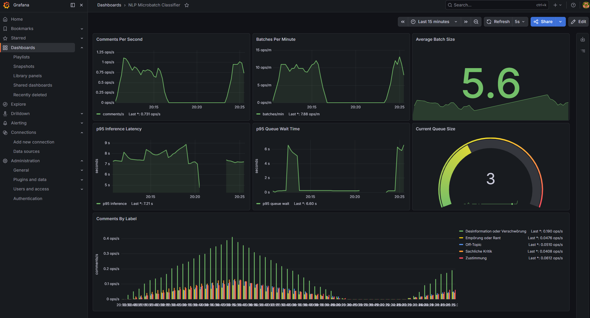

# NLP Microbatch Classifier

Author: Vito Basile, CAS AI Operations

---

Dieses Projekt implementiert einen NLP-Inference-Service mit Microbatching zur Klassifikation von Kommentaren einer fiktiven Online-Zeitung.

Der Service verwendet Zero-Shot Classification mit dem Hugging Face Modell `facebook/bart-large-mnli` und stellt Prometheus-Metriken für das Monitoring mit Grafana bereit.

Das Projekt demonstriert:

- NLP-Inference mit Hugging Face Transformers
- asynchrones Microbatching mit FastAPI
- Prometheus-Metriken
- Grafana-Dashboard-Visualisierung
- containerisierten Betrieb mit Docker Compose

---

## Repository klonen

Projekt lokal klonen:

```bash
git clone git@github.com:basvit/nlp-microbatching-classifier.git
```

In das Projektverzeichnis wechseln:

```bash
cd nlp-microbatching-classifier
```

---

## Architektur

Das System besteht aus drei Hauptservices:

1. **Classifier Service**
   - FastAPI-basierter NLP-Inference-Service
   - asynchrones Microbatching
   - Hugging Face Zero-Shot Classification
   - Prometheus Metrics Endpoint

2. **Prometheus**
   - sammelt Metriken vom Classifier-Service
   - speichert Zeitreihen-Daten

3. **Grafana**
   - visualisiert Prometheus-Metriken
   - stellt Dashboards bereit

---

## Verwendete Technologien

- Python 3.11
- FastAPI
- Hugging Face Transformers
- PyTorch
- AsyncIO
- Prometheus
- Grafana
- Docker
- Docker Compose
- uv
- Ruff

---

## Projektstruktur

```text
app/
├── classifier.py
├── config.py
├── main.py
├── metrics.py
├── microbatch.py
├── models.py
├── routes.py
|
grafana/
└── dashboards.json
|
loadtest/
└── load_generator.py
|
prometheus/
└── prometheus.yml
|
screenshots/
└── dashboard.png
|
├── .gitignore
├── .python-version
├── docker-compose.yml
├── Dockerfile
├── main.py
├── pyproject.toml
├── README.md
└── uv.lock
```

---

## Microbatching-Konzept

Eingehende Requests werden nicht sofort verarbeitet.

Stattdessen werden Requests temporär in einer asynchronen Queue gesammelt und gemeinsam als Microbatch verarbeitet.

Ein Batch wird verarbeitet, sobald eine der folgenden Bedingungen erfüllt ist:

- das Batch-Timeout läuft ab (0.2 Sec)
- die maximale Batch-Grösse wird erreicht (8)

Die Implementierung verwendet:

- `asyncio.Queue`
- asynchrone Background Worker
- `asyncio.Future` zur Synchronisation der Responses

Dadurch können mehrere Kommentare gemeinsam in einem einzigen Transformer-Inference-Aufruf verarbeitet werden.

---

## Metriken

Der Service stellt Prometheus-Metriken unter folgendem Endpoint bereit:

```text
http://localhost:8000/metrics/
```

Implementierte Metriken:

| Metrik | Beschreibung |
|---|---|
| `comments_classified_total` | Anzahl klassifizierter Kommentare |
| `batches_processed_total` | Anzahl verarbeiteter Microbatches |
| `batch_size` | Verteilung der Batch-Grössen |
| `batch_inference_duration_seconds` | Dauer der Batch-Inference |
| `batch_wait_time_seconds` | Wartezeit innerhalb der Queue |
| `microbatch_queue_size` | Aktuelle Queue-Grösse |
| `comments_classified_by_label_total` | Klassifizierte Kommentare gruppiert nach Label |

---

## Grafana Dashboard

Das Grafana-Dashboard visualisiert:

- Kommentare pro Sekunde
- Batches pro Minute
- durchschnittliche Batch-Grösse
- p95 Inference-Latenz
- p95 Queue-Wartezeit
- aktuelle Queue-Grösse
- klassifizierte Kommentare nach Label

Das exportierte Dashboard befindet sich unter:

```text
grafana/dashboard.json
```

---

## Projekt starten

Alle Services starten:

```bash
docker compose up --build
```

Verfügbare Services:

| Service | URL |
|---|---|
| Classifier API | http://localhost:8000 |
| Swagger Docs | http://localhost:8000/docs |
| Metrics Endpoint | http://localhost:8000/metrics |
| Prometheus | http://localhost:9090 |
| Grafana | http://localhost:3000 |

Grafana Login: 

- User: admin
- Password: admin

---

## API-Beispiel

Beispiel Request:

```json
{
  "comment": "Ich habe den Artikel nicht gelesen, bin aber trotzdem dagegen."
}
```

Beispiel Response:

```json
{
  "comment": "Ich habe den Artikel nicht gelesen, bin aber trotzdem dagegen.",
  "label": "Empörung oder Rant",
  "score": 0.72
}
```

---

## Load Testing

Für die Simulation von Last ist ein asynchroner Load Generator enthalten.

Starten des Load Generators:

```bash
uv run python loadtest/load_generator.py
```

Der Generator sendet kontinuierlich parallele Requests an den Classifier-Service, damit Metriken und Grafana-Dashboards mit Daten gefüllt werden.

---

## Beobachtungen während des Loadtests

Ein Screenshot des Dashboards während des Loadtests befindet sich unter:

```text
screenshots/dashboard.png
```


Während des Loadtests konnten folgende Beobachtungen gemacht werden:

- Das Microbatching funktionierte korrekt. Bei hoher Last wurden mehrere Kommentare gemeinsam verarbeitet.
- Die durchschnittliche Batch-Grösse stieg bei höherer Request-Rate deutlich an.
- Die Queue-Grösse blieb während des Tests meist bei 0 oder kurzzeitig bei 3. Dies zeigt, dass der Service die erzeugte Last ohne relevante Rückstaus verarbeiten konnte.
- Die Queue-Wartezeit blieb sehr klein, da Requests schnell zu Microbatches zusammengeführt wurden.
- Die grösste Latenz entstand durch die eigentliche Transformer-Inference des Modells `facebook/bart-large-mnli`.
- Die Label-Verteilung zeigte, welche Arten von Kommentaren während des Loadtests überwiegend klassifiziert wurden.

---

## Mögliche Erweiterungen

Mögliche zukünftige Erweiterungen:

- GPU-basierte Inference
- dynamische Batch-Grössen
- Request-Priorisierung
- persistente Prometheus-Speicherung
- automatische Grafana-Provisionierung
